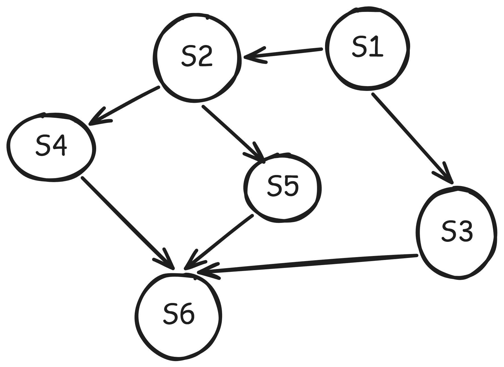
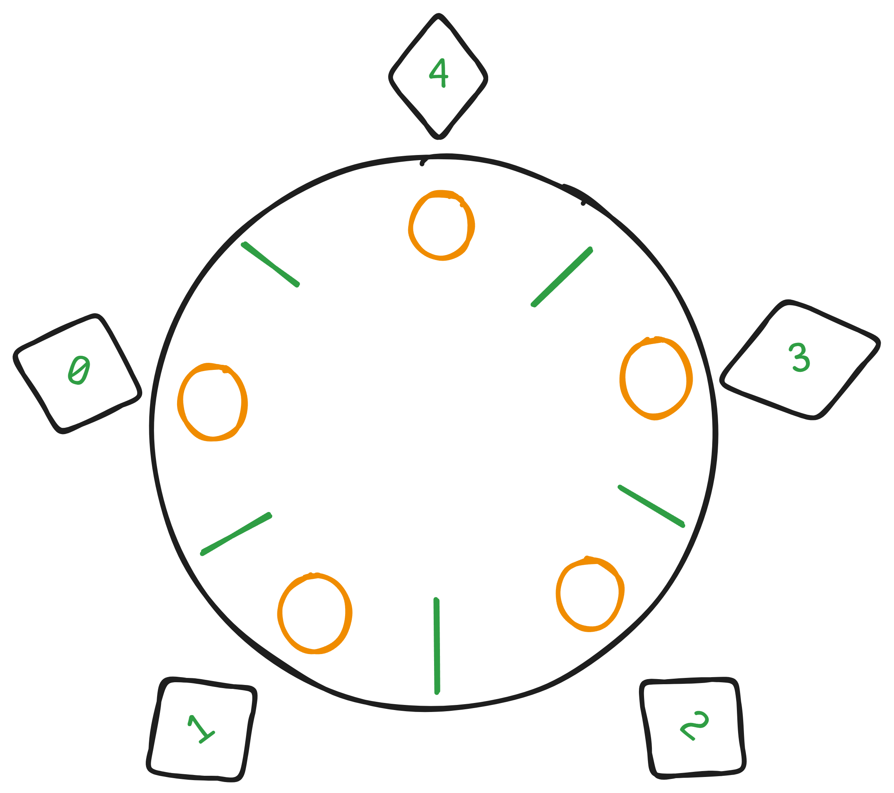

## 1. 同步和互斥的概念

**临界资源**：一次只能为一个进程使用的资源就叫临界资源，比如打印机

```cpp
while(1)
{
    entry section;
    critical section;
    exit section;
    remainder section;
}
```

- 进入区：检查临界资源是否可进，若可进，则设置正在访问临界资源的标志
- 临界区：访问临界资源的那段代码
- 退出区：将正在访问临界资源的标志清除
- 剩余区: 代码中其它部分


**同步：**直接制约关系，例如，A向管道中写数据，B从管道中读数据，只有A先写，B才能读，A和B同步

**互斥：**间接制约关系，例如A和B都要使用打印机资源，但是打印机一次只能被一个进程使用，A和B之间互斥。


**临界区的准则:**

- 空闲让进
- 忙则等待
- 有限等待：要保证进程在有限时间内进入临界区，不能无限等待
- 让权等待：（原则上应该，但非必须）当进程不能进入临界区，应该让出CPU，防止进程忙等

## 2. 实现临界区互斥的方法

### 2.1 软件实现方法

- 单标志法
- 双标志检查法
- 双标志后检查法
- PeterSon算法

#### 2.2.1 单标志法

- 设置一个公用整型变量turn
- 当turn = 0时，表示进程0可以进入临界区
- 当turn = 1时，表示进程1可以进入critical section
- 当turn = I时，表示进程I可以进入Critical Section
- 在进程I退出时，在将turn设置为下一个要进入临界区的进程ID


```cpp
size_t turn = 0;

// Process 0
while(turn != 0)
    ; //无限循环等待
critical section;
turn = 1;
remainder section;

// Process 1

while(turn != 1)
    ;
critical section;
remainder section;

```

算法缺陷：

- 两个进程必须要交替的进入临界区，若某个进程不再进入临界区，另一个进程也无法进入

- while循环一直等待，违背了空闲让进的原则。

  

#### 2.2.2 双标志先检查法

- 设置一个bool类型数组flag[2],用来标记各个进程进入临界区的意愿
- flag[i] = true表示 进程Pi 想要进入临界区
- 在进入临界区之前，检查数组中是否全部是false,若是，则表示现在没有进程访问临界区


```cpp
bool flag[2] {false, false};

//进程P0
while(flag[1])         //OP[1]
    ; //循环等待
flag[0] = true;        //OP[3]
critical section;
flag[0] = false;
remainder section;

//进程P1
while(flag[0])          //OP[2]
    ; //循环等待
flag[1] = true;         //OP[4]
critical section;
flag[1] = false;
remainder section;
```

优点：

- 相较于单标志法，解决了必须交替进入临界区的问题

缺点:

- 操作按照OP[1]\[2]\[3][4]进行时，可能会发生进程切换，然后双方都检查通过，都进入临界区，违背了`忙则等待`的原则
- while循环一直等待，违背了让权等待原则


#### 2.2.3 双标志后检查法

双标志先检查法是先检查对方标志，再设置自己标志，但是在设置标志时，可能会发生进程切换，从而违背了忙则等待的原则

双标志后检查法避免了这个问题

```cpp
bool flag[2] {false, false};

//进程P0
flag[0] = true;  //OP[1]
while(flag[1])   //OP[3]      
    ; //循环等待
critical section;
flag[0] = false;
remainder section;

//进程P1
flag[1] = true;   //OP[2]
while(flag[0])    //OP[4]      
    ; //循环等待
critical section;
flag[1] = false;
remainder section;
```


缺点:

按照操作OP[1]\[2][3]\[4]执行时，都设置为true, 结果都进不去，违背了`空闲让进`原则，同时这是个死锁，违背了`有限等待原则`，while循环等待违背了`让权等待`原则.

#### 2.2.4 PeterSon算法

该算法是单标志检查法和双标志后检查法的结合

优点

- 用flag 解决互斥问题
- 用turn解决饥饿问题

```cpp
flag[0] = true;
size_t turn = 1;
//进程P0

while(flag[1] && turn == 1)
    ;
Critical section;
flag[0] = false;
remainder section;


//进程P1
flag[1] = true;
turn = 0;
while(flag[0] && turn == 0)
    ;
critical section;
flag[1] = false;
remainder section;
```

缺点:

- while循环等待，没有遵循`让权等待原则`

### 2.2 硬件实现方法

- 中断屏蔽方法
- 硬件指令方法 -- TestAndSet指令
- 硬件指令方法 -- Swap指令


#### 2.2.1 中断屏蔽方法

因为CPU只会在发生中断时才会引起进程切换，因此关闭中断，能够保证当前运行的进程顺利执行完临界区代码。执行完后再开中断

```
...
关中断
临界区
开中断
...
```

缺点:

- 限制了CPU的交替执行程序的能力，效率明显降低
- 将关中断的权限交给用户很不明智，若一个进程关中断后不开中断，系统会崩溃
- 不适用与多处理器系统，一个CPU上关中断，不影响进程在其他CPU上执行临界区代码


#### 2.2.2 硬件指令方法 -- TestAndSet指令

为每一个临界资源设置一个共享变量lock,表示该资源的两种状态,初值为false.

- true 表示被占用（已加锁）
- false表示空闲（未加锁）

```cpp
boolean TestAndSet(boolean *lock)
{
    boolean old;
    old = *lock;
    *lock = true;
    return old;
}
```

将lock视为一把锁，进程在进入临界区之前，先用TS指令检查lock值

- 若为false,表示没有进程在临界区，可进入,并将lock设置为true
- 若为true, 表示有进程在临界区，进入循环等待

使用TS指令实现互斥的过程如下:

```cpp
while(TestAndSet(&lock))
    ;
临界区代码...
lock = false;  //解锁
进程其他代码...
```

缺点:

- 如果lock是true; 进程一直卡在while循环中， **没有实现让权等待**


#### 2.2.3 硬件指令方法 -- Swap指令

Swap指令的功能是交换两个字节的内容.

为每个临界资源设置一个共享bool变量lock,初值为false;

在每个进程中再设置一个局部bool变量Key,初值为true,用于与lock交换信息

```cpp
Swap(boolean *a, boolean *b)
{
    boolean *temp = a;
    *a = *b;
    *b = *temp;
}
```

Swap指令和TS指令没有太大区别，先记录此时临界区是否已加锁，再将锁标志lock设置为true,最后检查Key,若Key为false,说明没有其他进程对临界区加锁

于是跳出循环，进入临界区

```cpp
boolean Key = true;
while(key != false)
    Swap(&lock, &key);
CriticalSection;
lock = false;
remainder section;
```


#### 2.2.4 硬件实现方法总结

使用硬件指令实现互斥的优点；

- 硬件指令由硬件实现，是原子操作，不会被中断
- 简单、容易验证其正确性
- 适用于任意数量的进程，支持多处理器系统
- 支持系统中有多个临界区，只需要为每个临界区设立一个boolean变量

缺点:

- 等待进入临界区的进程会占用CPU执行while循环，**没有实现让权等待**
- 从等待进程中随机选择一个进入临界区，有的进程可能一直选不上，**从而导致进程饥饿现象**

### 3. 互斥锁

解决临界区最简单的工具是互斥锁(mutex lock).

- 一个进程在进入临界区之前调用acquire()获得锁
- 退出临界区时调用release()释放锁
- 每个锁有一个bool变量available，表示锁是否可用
  - 锁可用 ： 调用acquire成功，且锁不再可用
  - 锁不可用: 调用acquire失败
- 当一个进程试图调用一个不可用的锁时，会被阻塞，直到锁变得可用

```cpp
acquire()
{
    while(!available)
        ; //阻塞
    available = true;
}
release()
{
    available = true;
}
```

acquire()和release()执行必须是原子操作. 因此互斥锁通常采用硬件机制来实现.


### 4. 信号量

信号量机制可以用来解决互斥和同步问题.

Wait和Sigal, 也叫PV操作

- P表示申请资源
- V表示释放资源

#### 4.1 整形信号量

定义一个表示资源数量的整形量 S；

```
Wait(s)
{
	while(s <= 0)
		;
	s = s -1;
}
Signal(S)
{
	S = S+1;
}
```

缺点：

- 当 S <=0 时， Wait操作一直在While循环里面，进程忙等， 没有遵循让权等待原则


#### 4.2 记录型型号量

```cpp
typedef struct{
	int value;
	struct process * L;
}semaphore;

void Wait(semaphore S) 
{
	s.valve--;
	if(s.valve <0)
		add this process to S.L
		block (S.L)
}
void Signal(semaphore S)
{
	s.valve++;
	if(s.valve <=0)
		remove a process P from S.L
		WakeUp P
}
```


#### 4.3 使用信号量实现同步

```cpp
semaphore S = 0; //初始化信号量为0

ProcessA()
{
    //其它语句
    V(S);
    ...
}

ProcessB()
{
    //其它语句
    P(S);
    ...;
}
```


#### 4.4 使用信号量实现互斥

```cpp
semaphore S = 1;

ProcessA()
{
    P(S);
    ...;
    V(S);
}

ProcessB()
{
    P(S);
    ...;
    V(S);
}
```

#### 4.5 利用信号量实现前驱关系

信号量可以用来描述程序和语句之间的前驱关系.




题目描述:

- 有S1 ~ S6一共6个操作
- S1完成后才能执行 S2和S3操作
- S2完成后才能执行S4和S5操作
- 只有在S3和S4和S5完成后, 才能执行S6操作.


信号量设置:

- 上面一共7个箭头, 设置7个信号量. 初始值为0.

```cpp
semaphore a12, a13, a24, a25, a46, a56, a36 = 0;

S1()
{
    V(a12);
    V(a13);
}

S2()
{
    P(a12);
    V(a24);
    V(a25);
}

S3()
{
    P(a13);
    V(a36);
}

S4()
{
    P(a24);
    V(a46);
}

S5()
{
    P(a25);
    V(a56);
}

S6()
{
    P(a36);
    P(a46);
    P(a56);
}
```


### 5. 生产者消费者问题

题目描述:

- 系统中有一组生产者和一组消费者进程
- 生产者每次生产一个产品放入缓冲区
- 消费者每次从缓冲区中拿走一个产品并消费
- 只有缓冲区不满时，生产者才可以放
- 只有缓冲区不空时，消费者才可以拿
- 缓冲区大小为n, 且为临界资源，各进程必须互斥访问


题目分析:

- 生产者和消费者对缓冲区的访问是互斥关系. 
- 生产者和消费者也是同步关系, 只有生产者先生产, 消费者才能后消费.


信号量设置:

- 信号量mutex作为互斥信号量,用于控制生产者和消费者对缓冲区的互斥访问, 初始值为1.
  - 生产者生产时, P(Mutex), 离开后 V(Mutex).
  - 消费者消费时, P(Mutex), 离开后 V(Mutex).
- 信号量empty用于记录空缓冲区数量, 初始值为n.
  - 生产者生产时, P(empty)
  - 消费者消费时, V(empty)
- 信号量full用于记录当前缓冲区"满"缓冲区数量.
  - 生产者生产时, V(Full)
  - 消费者消费时, P(Full)

```cpp
semaphore empty = n;
semaphore mutex = 1;         //保证各个进程对临界区的互斥访问
semaphore full = 0;         //缓冲区初始化为0


producer()
{
    while(1)
    {    
    	生产一个产品；
    	P(empty);  //获取空缓冲区单元
    	P(mutex);   //获取对缓冲区的互斥访问

    	将产品放入缓冲区;
    	V(mutex);
    	V(full);
    }
}

consumer()
{
    while(1)
    {
    	P(full); 
    	P(mutex);
        
    	从缓冲区拿走一个产品
    	V(empty);
    	V(mutex);
    	消费产品
    }
}
```


注意事项: **对empty和full变量的P操作, 必须放在mutex的P操作之前.**

```cpp
生产者:
	P(mutex);
	P(empty);

	V(mutex);
	V(full);

消费者:
	P(mutex);
	P(full);

	V(empty);
	V(mutex);
```


- 生产者先P(mutex)
- 如果此时缓冲区已满, 生产者P(empty)失败, 必须等待消费者 V(empty).
- 然而此时消费者P(mutex)失败, 必须等待生产者V(mutex).
- 形成死锁.


再看下面一种情况:

```
生产者:
	P(empty);
	P(mutex);
	
	V(full);
	V(mutex);
	
消费者:
	P(mutex);
	P(full);
	
	V(mutex);
	V(empty);
```

- 假设消费者先P(mutex), P(full)失败, 说明此时缓冲区没有物品, 必须等待生产者 V(full)
- 生产者先P(empty)成功, 但是P(mutex)失败. 必须等待消费者V(mutex)
- 形成死锁.


---


题目描述

- 桌子上有一个盘子

- 妈妈一次只能往盘子里放一个橘子

- 爸爸一次只能往盘子里放一个苹果

- 儿子只吃苹果

- 女儿只吃橘子
- 盘子里只能放一个水果


题目分析:

- 四个进程, 爸爸, 妈妈, 儿子和女儿, 盘子是临界资源
- 爸爸和妈妈是互斥关系，爸爸和儿子是同步关系，妈妈和女儿是同步关系


信号量设置:

- 设置信号量 plate 表示对盘子这个临界资源的互斥访问. 初始值为1.
- 信号量apple, 表示盘子里是否有苹果, 初始值为0.
- 信号量orange, 表示盘子里是否有橘子, 初始值为0.

```cpp
semaphore palte = 1;
semaphore apple = 0;
semaphore orange = 0;

void Mom()
{
    while(1)
    {
        准备一个橘子
    	P(plate);
    	把橘子放入盘子...
    	V(orange);
    }
}

void Dad()
{
    while(1)
    {
        准备一个苹果
    	P(plate);
    	把苹果放入盘子...
   		V(apple);
    }
}

void daughter()
{
    while(1)
    {
    	P(orange);
        从盘子中取走橘子
    	...
    	V(plate);
        吃掉橘子
    }
}

void Son()
{
    while(1)
    {
        P(apple);
        从盘子中取走苹果...
        V(plate);
        吃掉苹果
    }
}
```


### 6. 读者写者问题

题目描述:

- 有读者和写者两组并发进程共享一个文件

- 允许多个读者进程对文件进行读操作.
- 同一时刻一次只允许一个写进程执行写操作
- 任意一个写者进程在完成写操作之前，不允许其他进程执行读和写操作.
- 写进程执行写操作前，应该等待已有的读者和写者全部退出。


题目分析:

- 写者和读者是互斥的, 读文件的时候,不允许写, 写文件的时候,不允许读.
- 写者和写者也是互斥的, 不允许多个写者同时写一个文件.
- 读者和读者不存在互斥.

信号量设置:

- 设置信号量count为计数器, 记录当前读者数量, 初始值为0.
- 设置互斥信号量mutex, 用于保护更新count变量时的互斥.
- 设置互斥信号量rw, 用于保证读者和写者对文件的互斥访问.


```cpp
int count = 0;
semaphore mutex = 1;
semaphore rw = 1;

reader()
{
    while(1)
    {
        P(mutex);
        if(count == 0)
            P(rw);
        count++;
        V(mutex);
        
        //读文件
        P(mutex);
        count--;
        if(count == 0)
         V(rw);  
        V(mutex);
    }
}

writer()
{
    while(1)
    {
        P(rw);
        //写文件
        V(rw);
    }
}
```


上面的代码中, 读进程是优先的. 即存在读进程时, 写操作被延时, 而且只要还有一个读进程存在, 随后而来的读进程都允许访问文件.

这样会导致写进程长时间等待. 下面是写进程优先

- 有写进程请求访问时, 应该禁止后序读进程的请求
- 等到最后一个读进程退出后, 立即让写进程进入
- 等到写进程完成后, 才允许读进程进入.

信号量设置:

- 信号量count 用于记录当前读者数量.
- 设置设置信号量mutex, 用于保护更新count时的互斥
- 设置信号量rw，用于保护读者和写者, 写者和写者之间互斥的访问文件.
- 设置信号量 w, 用于设置写优先


```cpp
int count = 0;
semaphore mutex = 1;
semaphore rw = 1;
semaphore w = 1;

reader()
{
    while(1)
    {
        P(w);
        P(mutex);
       	if(count == 0)
            P(rw);
        count++;
        V(w);
        
        //读文件
        
        P(mutex);
        count--;
        if(count == 0)
            V(rw);
        V(mutex);
        
    }
}

writer()
{
    while(1)
    {
        P(w);
        P(rw);
        // 写文件
        V(rw);
        V(w);
    }
}
```

这里的写进程优先是相对而言的. 有些书上将这个算法称为**读/写公平算法**, 读进程和写进程具有一样的优先级.

当一个写进程访问文件时, 后面有若干个读进程要求访问文件, 最后面有一个写进程要求访问文件, 则当前写进程结束写操作时.

下一个是读进程而不是写进程访问文件, 因为信号量w的阻塞队队列上, 读进程先进来, 排在队首. 


### 7. 哲学家进餐问题




题目描述:

- 一张桌子上有5个哲学家, 5只筷子, 5碗米饭, 米饭放在两根筷子中间.
- 哲学家思考时,不影响它人.
- 哲学家进餐时, 才会试图拿起两根筷子, 不是同时拿起, 是一根一根拿起.
- 如果筷子在他人手上, 则需要等待.
- 饥饿的哲学家只有拿到两根筷子才能进餐, 进餐完毕后, 放下筷子思考.


题目分析:

- 这里有5个进程. 5名哲学家对两两之间的筷子的访问是互斥关系.
- 题目要解决的是如何让哲学家拿到左右两根筷子, **且不造成死锁**.


信号量设置:

- 定义互斥信号量数组chopstick[5] = {1, 1, 1, 1, 1}. 用于对5根筷子的互斥访问.
- 哲学家按照顺序编号,0, 1, 2, 3, 4.
- 哲学家i左边筷子的编号是i, 右边筷子的编号是 (i+1)%5.

```cpp
semaphore chopstick[5] = {1, 1, 1, 1, 1};
Pi()
{
    do
    {
        P(chopstick[i]);
        P(chopstick[(i+1)%5]);
        进餐;
        V(chopstick[i]);
        V(chopstick[(i+1)%5]);
        思考;
    }while(1);
}
```

该算法存在以下问题:

5名哲学家都拿起了左边的筷子, 此时执行完`P(chopstick[i])`. 所有筷子已经被全部拿光, 等到他们执行`P(chopstick[(i+1)%5])`来拿起右边筷子时,已经无筷子可以拿, 造成死锁.

为了避免死锁的发生, 可以添加一些限制条件. 下面是一些解决办法:

- :one:最多允许4名哲学家同时进餐, 这样可以保证至少有一位哲学家可以拿到左右筷子
- :two:仅当一名哲学家左右筷子都可以拿时, 才允许它拿起筷子.

假设采取第二种方法；

信号量设置:

- mutex信号量, 保证哲学家必须拿完两根筷子

```cpp
semaphore mutex = 1;
semaphore chaopstick[5] = {1, 1, 1, 1, 1};

Pi
{
	do
    {
        P(mutex);
        P(chopstick[i]);
        P(chopstick[(i+1)%5]);
        V(mutex);
       	进餐;
        V(chopstick[i]);
        V(chopstick[(i+1)%5]);
        思考;
    }while(1);
}
```

注意`V(mutex)`的位置, 上面的代码是保证哲学家一次可以拿到两根筷子, 下面的代码是一次只能有一位哲学家进餐.


```cpp
semaphore mutex = 1;
semaphore chaopstick[5] = {1, 1, 1, 1, 1};

Pi
{
	do
    {
        P(mutex);
        P(chopstick[i]);
        P(chopstick[(i+1)%5]);
      
       	进餐;
        V(chopstick[i]);
        V(chopstick[(i+1)%5]);
        
        V(mutex);
        思考;
    }while(1);
}
```


### 8. 管程

#### 8.1 管程的定义和操作

管程是一种进程同步工具，它保证了进程的互斥访问临界资源，无需程序自己实现。当然管程提供了条件变量，程序员也可以自定义实现进程同步

管程定义：

- 利用共享数据结构抽象的表示系统中的共享资源。

- 对数据结构实施的操作定义为一组过程，对共享资源的申请、释放等操作，都通过这组过程来实现。

- 这组过程可以根据资源情况，接受或阻塞进程的访问，确保每次只能有一个进程使用共享资源。

- 这个代表共享资源的数据结构，以及对数据结构实施操作的一组过程所组成的资源管理程序，叫做**管程**


```cpp
monitor Demo  //定义一个名为Demo的管程
{
    struct S; //共享数据结构 ，表示某种共享资源
 	
    //初始值语句
    init_code(){
        S = 5;  //初始化资源数 = 5
    }
    
    take_away(){
        //对资源S的处理
        S--; // 可用资源数量-1
        ...
	}
    give_back(){
        S++;
        ...
    }
}
```

由上述定义可知，管程由四个部分组成:

- 管程的名称
- 局部于管程内部的共享数据结构，表示某种资源
- 对共享数据结构的操作方法或者函数.
- 局部于管程内部的共享数据结构的初始值语句

//自己的理解

管程更像是一个C++类,对资源进行封装，要想申请资源，只能调用类的函数


#### 8.2 条件变量

一个进程进入管程后被阻塞，直到阻塞的原因解除前，

若进程不释放管程，则其它进程无法进入管程。

为此，将阻塞原因定义为条件变量Condition.

进程被阻塞的原因有很多种，因此可以在管程中设置多个条件变量

每个条件变量保存了一个等待队列，用于记录因为该条件变量而阻塞的所有进程，

对条件变量只能有两种操作，`Wait`和`Signal`

- X.wait: 当x条件不满足时, 调用Wait,将自己插入X的队列，并释放管程, 此时其它进程可以进入管程
- X.signal: X对应的条件发生变化, 调用Signal,从队列中唤醒另一个因为X条件被阻塞进程.

```cpp
monitor Demo
{
    struct S;
    init_code(){ S = 5; }// 初始化资源数量
    
    condition x;
    take_away(){
        if(S<=0) x.wait();
        ....
	}
    
    give_back(){
        归还资源;
        if(有进程在等待) x.signal(); //唤醒一个阻塞基础进程
	}
    
}
```

条件变量和信号量的比较:

相似点:

- Wait和Signal操作类似信号量的PV操作

不同点:

- 条件变量是没有值的，仅仅实现了排队等待功能。
- 信号量是有值的，它反映了资源数量，在管程中，剩余资源数量用共享数据结构记录。
