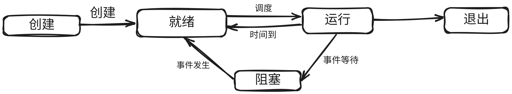

## 1. 进程的概念和特征

## 2. 进程的组成

进程由三部分组成:

- PCB 进程控制块
- 程序段
- 数据段

### 2.1 PCB进程控制块

一个PCB主要包含以下内容:

- 进程描述信息

  - 进程标识符PID
    - 用于标志各个进程, 每个进程都有唯一的PID
  - 用户标识符UID
    - 用于标记进程所归属的用户, 主要为共享和保护服务

- 进程控制和管理信息

  - 进程当前状态
    - 描述进程状态信息, 是运行态还是阻塞态?还是其它什么状态, 并以此作为CPU分配调度的依据.
  - 进程优先级
    - 描述进程抢占CPU的优先级.
  - 代码运行入口地址
  - 程序的外存地址
  - 进入内存时间
  - CPU占用时间
  - 信号量使用

- 资源分配清单

  - 代码段指针
  - 数据段指针
  - 堆栈段指针
  - 文件描述符
  - 键盘
  - 鼠标

- 处理机相关信息: 也叫CPU上下文, 主要是各个寄存器的值,但进程被切换又被重新运行时, 要根据CPU上下文恢复现场,继续执行.

  - 通用寄存器值
  - 地址寄存器值
  - 控制寄存器值
  - 标志寄存器值
  - 状态字

  

###  2.2 程序段

### 2.3 数据段

## 3. 进程的状态和转换

通常进程有5种状态, 前三种状态是进程的基本状态

- :one:运行态: 进程正在运行, 在单CPU中, 每一时刻只有一个进程处于运行态
- :two:就绪态: 进程获得除了CPU外的一切所需资源, 一旦得到CPU就可以立即运行. 系统中可以有多个就绪态的进程, 他们按照优先级拍成一个队列, 称为就绪队列.
- :three:阻塞态: 也叫等待态, 进程正在等待某一时间而暂停运行, 比如等待IO完成, 即使CPU空闲, 该进程也不能运行, 同样系统也有一个阻塞队列.
- 创建态: 进程正在被创建,还没有转到就绪态.
- 终止态: 进程正在从系统中消失. 

### 3.1 引起进程状态转换的事件

- 就绪态 --> 运行态
  - 进程被调度, 获得时间片.

- 运行态 --> 就绪态
  - 进程的时间片用完了.
  - 更高优先级的进程就绪, 自己的CPU时间片被剥夺
- 运行态 -->阻塞态
  - 进程请求某一资源的分配, 或者等待某一事件的发生.
- 阻塞态 --> 就绪态
  - IO操作完成, 中断结束.

一个进程从运行态变成阻塞态是主动的行为, 但是从阻塞态变成就绪态是被动行为, 需要其它相关进程的协助.

## 4. 进程控制

### 4.1 进程的创建

导致进程创建的事件或操作:

- 终端用户登录系统
- 作业调度
- 系统提供服务
- 用户程序的应用请求

进程创建的过程(**创建原语**):

- 为新进程分配一个唯一的进程标识符, 并申请一个空白的PCB, PCB是有限的, PCB申请失败, 进程就创建失败.

- 为进程分配运行所需的资源, 内存、文件、IO设备和CPU时间(在PCB中体现).这些资源从操作系统获得, 或者仅仅从父进程获得.
  - 如果资源不足, 不是创建进程失败, 而是处于创建态,等待资源
- 初始化PCB, 主要包括初始化标志信息, 初始化CPU状态信息, 初始化CPU控制信息.以及设置进程的优先级等.
- 如果就绪队列能够容纳新进程, 则将新进程插入就绪队列, 等待被调度运行.

### 4.2 进程的终止

导致进程终止的事件或操作:

- 正常结束, 进程的任务已经完成.
- 异常结束, 进程在运行时, 发生了某种异常事件, 程序无法继续运行, 比如下面情况:
  - 存储区越界
  - 保护错
  - 非法指令
  - 特权指令错
  - 运行超时
  - IO故障
  - 算术运算错
- 外界干预， 比如操作系统干预, 父进程请求和父进程终止.

进程终止的过程(**终止原语**):

- 根据被终止进程的标识符, 检索出该进程的PCB, 从中读取出进程的状态.

- 若进程处于运行态, 则立刻终止运行, 将CPU时间片分配给其它进程
- 若进程还有子孙进程, 通常需要将子孙进程终止
- 将该进程拥有的全部资源, 或归还给父进程, 或归还给操作系统.
- 将PCB在所在队列中删除.

### 4.3 进程的阻塞

导致进程阻塞的事件或操作:

- 由于期待的某些事件没有发生, 如请求系统资源失败, 等待某种操作的完成, 新数据没有到达, 无新任务可做.

进程阻塞的过程(**阻塞原语**):

- 找到要被阻塞进程的PID对应的PCB.
- 若该进程是运行态, 则保护现场, 将其状态转为阻塞态, 停止运行.
- 将该进程的PCB插入相应事件的等待队列, 将CPU资源调度给其它就绪进程.

阻塞是进程自身的一种主动的行为, 只有处于运行态的进程,才可能转为阻塞态.

### 4.4 进程的唤醒

到进程唤醒的事件或操作:

- 被阻塞进程期待的事件出现.比如IO操作完成, 或所期待的数据已经到达.

进程唤醒的过程(**唤醒原语**):

- 在该事件的等待队列中找到对应进程的PCB
- 将其从等待队列中移出, 并设置状态为就绪态.
- 将该PCB插入就绪队列,等待调度程序调度.

阻塞原语和唤醒原语是一对作用相反的原语, 必须成对使用.

## 5. 进程的通信

- 共享存储
- 消息传递
- 管道通信
- 信号

## 6. 线程和多线程模型

### 6.1 线程的概念

线程的组成:

- 线程ID
- 程序计数器
- 寄存器集合
- 堆栈

线程自己不拥有系统资源, 只拥有一点在运行中必不可少的资源.但是它可以与同属于一个进程的线程共享进程所拥有的全部资源, 一个线程可以创建和撤销另一个线程.

同一个进程中的线程可以并发执行. 由于线程之间相互制约, 线程也有就绪，阻塞，运行三种基本状态.

### 6.2 线程和进程的比较

### 6.3 线程的属性

### 6.4 线程的状态与转换

### 6.5 线程的组织与控制

#### 6.5.1 线程控制块

每个线程都有一个线程控制块TCB. 用于记录控制和管理线程的信息, TCB包含以下信息:

- 线程标识符 TID
- 一组寄存器
  - 程序计数器
  - 状态寄存器
  - 通用寄存器
- 线程运行状态
- 线程优先级
- 线程专有存储区, 线程切换时用于保存现场.
- 堆栈指针， 用于过程调用时保存局部变量和返回地址

同一进程中的所有线程都能访问进程的地址空间和全局变量. 但是每个线程都拥有自己的堆栈, 其互不共享.

#### 6.5.2 线程的创建

用户程序启动时, 通常仅有一个称为**初始化线程**的线程正在运行, 其主要功能是创建新线程.

在创建新线程时, 需要利用一个线程创建函数, 并提供相应的参数, 如指向主程序的入口指针, 堆栈的大小, 线程的优先级等等.

#### 6.5.3 线程的终止

### 6.6 线程的实现方式

#### 6.6.1 用户级线程 ULT

用户级线程: User-level Thread

用户级线程就是用户角度能看到的线程. 线程的创建、切换和撤销的所有工作都应该在用户态完成, 无需操作系统的干预.内核意识不到线程的存在.

对于用户级线程, CPU调度仍然是以进程为单位进行调度的.每个进程轮流执行一段时间.

假设A进程有1个线程, 进程B有100个线程.

这样进程A中的线程的运行时间将时进程B中各线程运行时间的100倍.

ULT的优点如下:

- 线程切换不需要转到内核空间, 节省了切换的开销
- 调度算法可以是进程专用的, 不同进程可以根据自身需要, 对自己的线程选择不同的调度算法
- 用户级线程的实现与操作系统平台无关, 对线程管理的代码是属于用户程序的一部分.

ULT的缺点如下:

- 系统调用阻塞问题, 当该进程内的一个线程执行系统调用, 不仅该线程阻塞, 其它线程也阻塞.
- 不能发挥多CPU优势, 内核每次分配给一个进程的仅有1个CPU, 因此进程中仅有一个线程能够运行.

#### 6.6.2 内核级线程 KLT

内核级线程: Kernel-level Thread

#### 6.6.3 组合实现

### 6.7 多线程模型

